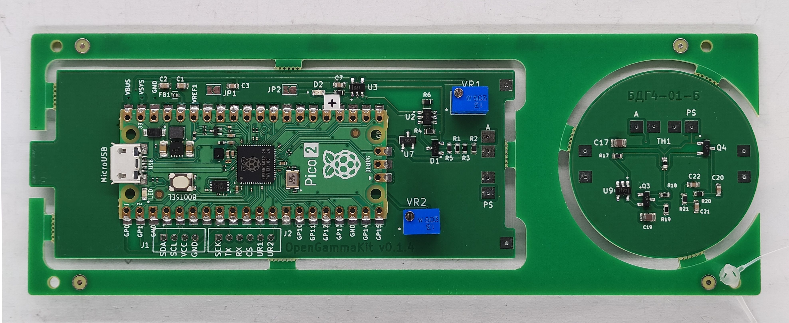
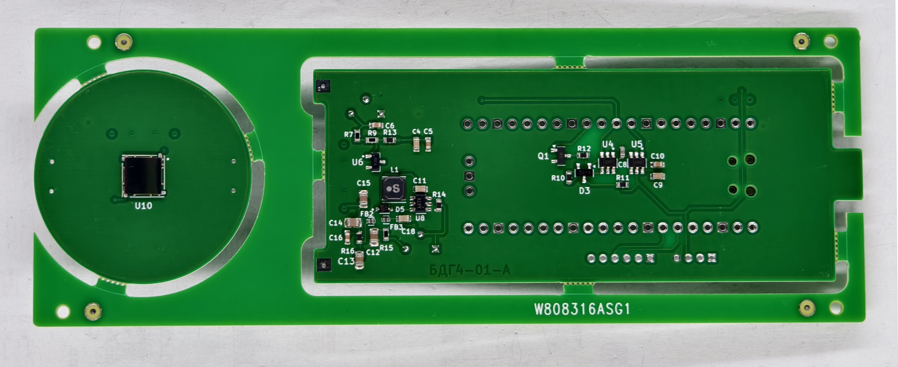
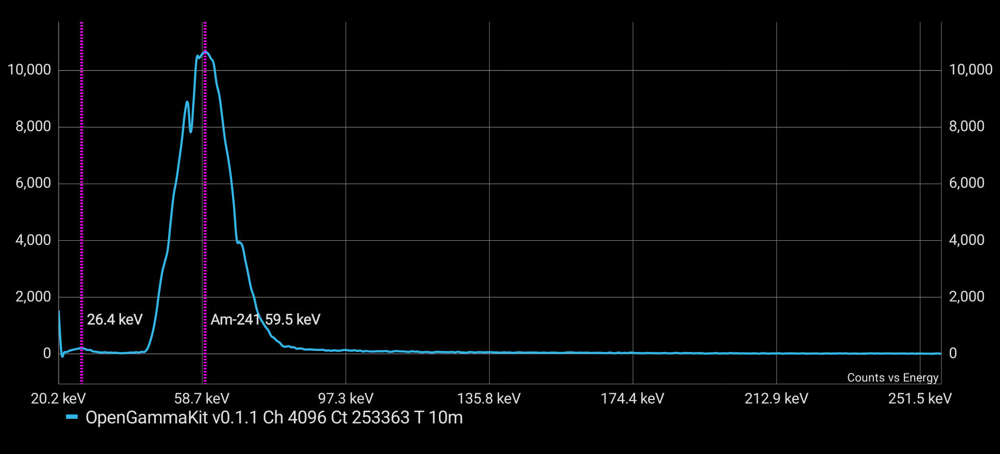

# OpenGammaKit

## PCB front and back side

<table>
  <tr>
    <td align="center">
      
       <b>Front view</b>
    </td>
    <td align="center">
      
       <b>Back view</b>
    </td>
  </tr>
</table>

**OpenGammaKit** is an open-source gamma spectrometer hardware platform, inspired by the excellent [Open-Gamma-Detector](https://github.com/OpenGammaProject/Open-Gamma-Detector). It takes the original schematic and redesigns the PCB using **KiCad** (originally designed in EasyEDA), making the project more accessible and modifiable for open hardware enthusiasts.

OpenGammaKit is designed to be affordable, reliable, and easy to integrate with embedded systems, mobile devices, or PCs—ideal for DIY nuclear instrumentation, educational labs, or citizen science.

---

## 🔧 Features

- ✅ Based on the **Open-Gamma-Detector** schematic  
- ✅ Complete redesign in **KiCad** with improved layout and routing  
- ✅ USB serial communication (compatible with Android 7.0+ and PCs)  
- ✅ Compatible with [OGK Inspector](https://github.com/vikulin/OGK-Inspector) Android app and [OGK Firmware](https://github.com/vikulin/OGK-Firmware) 
- ✅ Real-time gamma spectrum output and spectrometer integration  
- ✅ Works with scintillation detectors (e.g., CsI(Tl), NaI(Tl), etc.)  
- ✅ Open and editable source files for schematics and PCB

---

## 📂 Repository Contents

- `/docs/` – Spectrum([OGK Inspector](https://github.com/vikulin/OGK-Inspector))
- `/kicad-libraries/` – KiCad libraries, including custom footprints

---

## 📷 3D render previews of the boards

   
  
   
  

---

## 📦 Release Contents

OpenGammaKit releases version **0.1.5.5** and later include all the fabrication files required to manufacture and assemble the OpenGammaKit gamma spectrometer hardware:

| File Name                                     | Description                                                                |
| --------------------------------------------- | -------------------------------------------------------------------------- |
| `open-gamma-kit-gerber-files-<version>.zip`   | 🟢 Complete Gerber and Drill files for PCB fabrication.                    |
| `open-gamma-kit-centroid-file-<version>.csv`  | 📍 Centroid (Pick-and-Place) file in mils for automated assembly.          |
| `open-gamma-kit-<version>.pdf`                | 📄 PDF documentation                                                       |
| `BOM.csv`                                     | 📋 Bill of Materials (not archived — listed separately).                   |

📁 **Location**: All files are available in the [Assets](https://github.com/vikulin/OpenGammaKit/releases) release section.

---

## 🧠 Companion Projects

- **OGK Inspector (Android App)**  
  View spectra, calculate resolution, access terminal mode  
  👉 [OGK-Inspector on GitHub](https://github.com/vikulin/OGK-Inspector)

- **OGK Firmware**  
  USB serial interface firmware for supported microcontrollers  
  👉 [OGK Firmware Repository](https://github.com/vikulin/OGK-Firmware)

---

## Spectrum of ²⁴¹Am source measured with NaI(Tl) detector
| Element | Symbol | Atomic Number | Mass Number |
|---------|--------|----------------|--------------|
| Americium | Am     | 95             | 241          |

The spectrum clearly shows two gamma peaks at **59.54 keV** and **26.35 keV**, both corresponding to emissions from ²⁴¹Am:

- The **59.54 keV** peak is the most intense and commonly used for energy calibration.
- The **26.35 keV** peak is weaker but still visible, depending on detector resolution and shielding conditions.

   
  

> 📌 These lines are useful for calibration and spectral identification in low-energy gamma spectroscopy using NaI(Tl) detectors.

---

## 📜 License

This project is licensed under the **GNU General Public License v3.0**.  
See the [LICENSE](LICENSE) file for details.

---

## 🙌 Acknowledgements

- Based on the original design by [OpenGammaProject](https://github.com/OpenGammaProject/Open-Gamma-Detector)  
- Thanks to the open hardware and spectroscopy communities!

---
